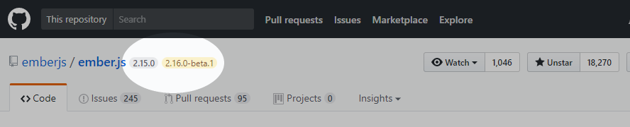
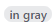
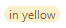

GitHub Version Tags
===================

Displays the latest version of a project next to the repo name on GitHub.

Features
--------

- Displays the latest semantic version tagged in the repo 
- Displays the next pre-release (if available) 
- Displays all versions on mouse hover

Installation
------------

Or manually:

1. Download or `git clone http://github.com/joeyespo/github-version-tags.git`
2. Open Chrome extensions and click on the `Load unpacked extension` button
3. Select the downloaded directory

How it works
------------

The extension requests the tags of the current repo from [the public GitHub API](https://developer.github.com/v3/repos/#list-tags),
performs a semver-sort (which supports the optional `v` prefix), and inserts
a `` next to the name. This is then cached until you leave the repo.

For private repos, it parses the tags from the `Switch branches/tags` dropdown.
This isn't as reliable since that HTML isn't on every page, but since you're
likely to want to see more versions of public repos than your own personal or
company repos, this keeps the project simple and avoids the auth concern.

Contributing
------------

1. Check the open issues or open a new issue to start a discussion around
   your feature idea or the bug you found
2. Fork the repository and make your changes
3. Open a new pull request

If your PR has been waiting a while, feel free to [ping me on Twitter](http://twitter.com/joeyespo).
